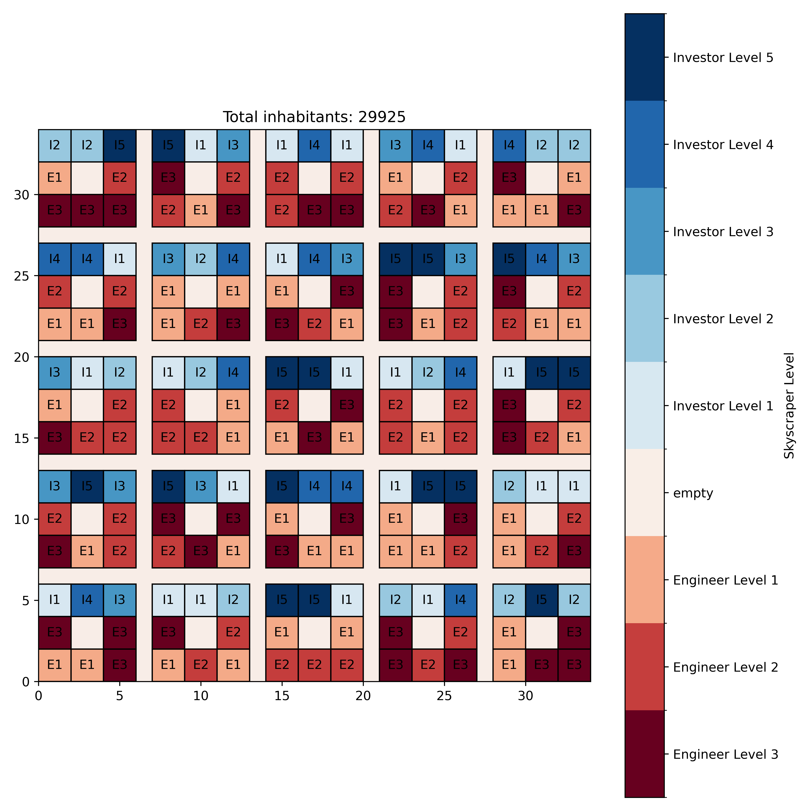

# ANNO 1800 Skyscraper Layout Optimizer
This layout optimizer works by taking in a predefined layout and then finds the (near) optimal way to upgrade skyscrapers to different levels in order to maximize population by randomly upgrading and downgrading some skyscrapers, discarding worse and keeping better configurations.  
[Skyscrapers](https://anno1800.fandom.com/wiki/Skyscrapers) in Anno 1800 benefit from Panorame, i.e. if a skyscraper is surrounded by buildings of lower height, this will increase its panorama and total population, being surrounded by higher buildings will decrease its panorama and total population.
A mixture of higher and lower level skyscrapers creates the highest benefits, finding the best layout is however very difficult.
If someone with more math knowledge than me can prove there is no analytical solution, that would be great.  
A solution based around trying all possible solutions [has been tried](https://github.com/Caracus/Anno1800Panorama) but this is infeasible for large amounts of buildings.
Randomly applying mutations to an initial distribution of skyscraper levels will increase or decrease the total population of the layout.
Only keeping the mutations that create an improvement will eventually converge to a solution that is close to the best possible solution.

## Example 
Starting Layout with randomly initialized house levels  


Layout after optimizing  


## Set up the environment
 - Have [Conda](https://docs.conda.io/en/latest/miniconda.html) installed according to the official instructions
 - Set up the conda environment and activate it then install dependencies enforced by poetry:
```bash
    conda env create -f environment.yml
    conda activate Anno1800Skyscraper
    curl -sSL https://install.python-poetry.org | python3 -
    poetry install
    poetry self update
```
If you have problems installing poetry, follow the installation instructions here:
[https://python-poetry.org/docs/#installation](https://python-poetry.org/docs/#installation)
## Usage
 - Create a Design or in [Anno Designer](https://github.com/AnnoDesigner/anno-designer) or use [Anno 1800 Savegame Visualizer](https://github.com/NiHoel/Anno1800SavegameVisualizer) to import your stamps or savegames into Anno Designer.
 - Save your design as a .ad-file in a separate folder in this project. I'll be using "./layouts/realistic" as an example here. If you want to run the tool multiple times, every layout needs their own directory.
 - Run the program with the following parameters:
   - dir (d): The directory your ad file is in
   - epochs (e): The number of epochs to run the program for. More houses need a higher number
   - change (c): The amount of houses to flip. Can be int for absolute values or float for relative values. This number varies depending on the size and shape of your layout. There's nothing but trying different values to find the best one, but lower values tend to work better in my experience.
 
   ```bash
    python main.py -d layouts/realistic -e 10000 -c .05
   ```
